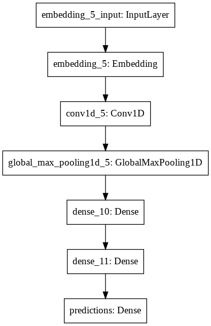
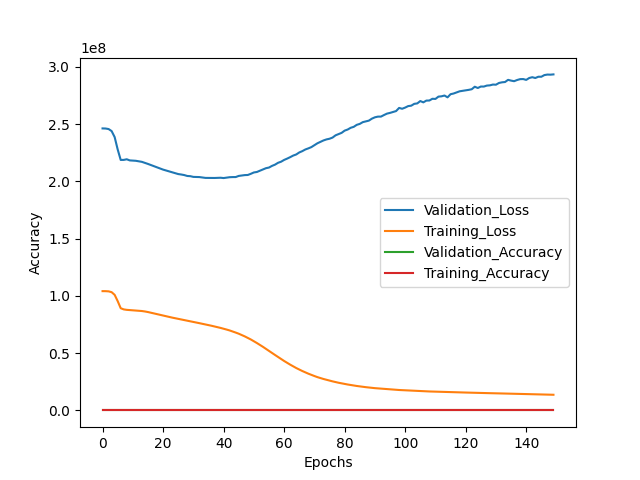
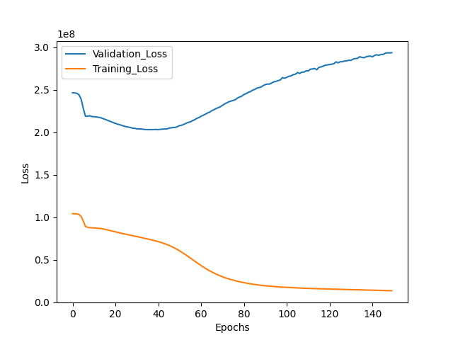

# Amazon ML Hackathon :
## Guide to Test The File
- Update the parameters.json file with the input path and output path.
- Change the "testpath" field with the path where the test/input file is located. 
- Change the "outputpath" field with the path where you want the output to stored.
- Run the main.py script to run the test (csv file) thorugh the trained model and get the corresponding results. 
<pre><code> python main.py</code></pre> 

## Approach For Data Cleaning 
- We observed the dataset and found alot of 
- We removed the stopwords
- We brought the words into actual form using lematizer
- We remove the single and double letter words as we believe that they do not much value to prediction of browse nodes.
- We also observed that completely capital words represented version names which do not provide significant information for the browse_nodes prediction.

## Approach For Vectorizing the Text
- we combined all the textual collumn (Title, Description, Bullet_points, Brand ) into a single TEXT collumn.
- Then this text collumn was vectorized using Tf-IDF vectorizer.
- We sorted the embeddings on tdidf score 
- Then we considered the tf-idf embeddings which formed the middle 90% of the total embedings

## Approach For Training 
- We tried the followig deep learning architecture for the training 

## Results

### Note: 
- The accuracy shown in plot is not the actual accuracy. This is due to the fact that we did not round the values when the model was being checked for accuracy.

## Commands To Create Environment
- pip install virtualenv env
- virtualenv env 
- env/scripts/activate
- pip install -r requirements.txt
